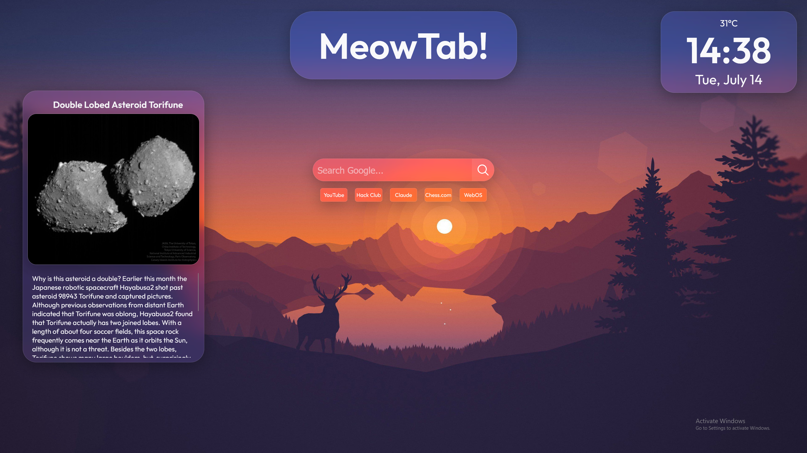

# Meow!
## A simple new tab page featuring a space fact.

## Features:
- Displays a fact about space
- Displays weather, time and date
- Search with Google
- 5 Quick access links

## Why did I choose this project?
I wanted to learn more about API's and how to implement them. Since I already shipped WebOS 2 and spent a lot of time there, I wanted to do something else that goes in a similar direction.

## What did I learn?
- How to fetch API data
- Using Vite
- What .gitignore and .env files are for
- How to create links that lead to other websites

## What was difficult?
- Getting the NASA API to work
- Understanding the file structure of a Vite project

## What was easy?
- Styling the website with CSS

## Credits:
- Louis Coyle for the beautiful background image
- NASA for the space facts

(AI usage: Some basic questions and CSS debugging)
